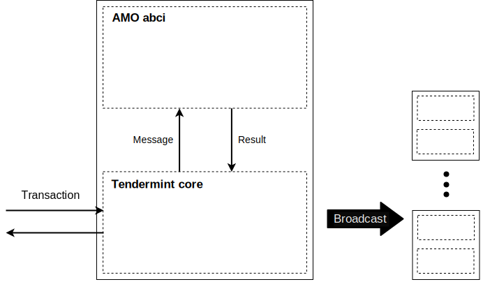

# AMO Blockchain Protocol Specification

## Introduction
Although the current implementation of AMO blockchain depends ***heavily*** on Tendermint, AMO blockchain protocol itself is independent of Tendermint. It is described by several protocol messages and corresponding state transition in abstract internal database of each blockchain node. While the protocol messages are concretely defined(meaning and format), abstract internal database of a blockchain node is implementation-specific. But, note that every AMO blockchain node **MUST** incorporate a kind of database storing all kinds of data items described in [Internal Data](#internal-data) section.

Some notes related to Tendermint will be tagged with **TM**.

## Data Format
### Key
AMO blockchain uses ECDSA key pair to sign and verify various transactions and messages. AMO blockchain uses NIST P256 curve as its default ECDSA domain parameter.

A key pair in AMO blockchain is a pair of a private key and a public key. A private key is a sequence 32 bytes, and a public key is a sequence of 65 bytes(uncompressed form with 0x04 prefix. TODO: give a reference). These byte sequences are represented by HEX encoding when transmitted over a communication channel or stored as a marshaled form, while they reside *as is* in a program's internal memory space.

### Key custody
A key custody is a special form of key transfer medium. It is a public-key encryption of a data encryption key: `PKEnc(PK, DEK)`, where `PKEnc` is a sort of a hybrid encryption (combination of public key encryption and symmetric key encryption). For `PKEnc`, we use a combination of ECDH ephemeral mode and AES. For ECDH ephemeral key generation, we use ECDSA key generation algorithm.`PK` is a public key of a recipient and `DEK` is a data encryption key of an encrypted *data parcel*.

### Account address
An address is a human-readable character string which is a hex-encoding of a byte sequence with the length of 20 bytes (=160-bit). Hence, the opaque form of an address is a 40-byte character string which consists of `[0-9]` and `[a-f]` only.

An account address is derived from the public key of an account. First, take 32 bytes by applying SHA256 on the public key bytes. Next, take 20 bytes by truncating the first 20 bytes from the 32-byte SHA256 output: `addr_bin = trunc_20(SHA256(PK))`. For the last step, convert this `addr_bin` by hex-encoding. An AMO-compliant program may utilize this `addr_bin` for its internal purpose, but it should apply hex-encoding before sending to other protocol party or storing to other medium outside the program.

**NOTE:** In Bitcoin, they use `addr_bin = RIPEMD160(SHA256(PK))`, but we cannot use RIPEMD160. See [Notes on Cryptography](crypto.md) for more details and reasons.

## Message Format
### Transaction
A transaction is a description of the state change in a blockchain node's internal database(i.e. blockchain state). In other words, sending a transaction to a blockchain node is the only way to change blockchain state. When a transaction is received by a node and eventually included in a _block_, a blockchain node shall modify the internal database according to each transaction type.

A transaction is represented by a JSON document which has the following format:
```json
{
    "type": "_tx_type_",
    "sender": "_sender_address_",
    "nonce": "_HEX-encoded_nonce_bytes_",
    "params": "_HEX-encoded_JSON_object_",
    "fee": "_currency_",
    "signature": {
        "pubkey": "_HEX-encoded_public_key_bytes_",
        "sig_bytes": "_HEX-encoded_signature_bytes_"
    }
}
```
`"_tx_type_"` is one of :
- coins and stakes
	- `"transfer"`
	- `"stake"`
	- `"withdraw"`
	- `"delegate"`
	- `"retract"`
- parcels
	- `"register"`
	- `"request"`
	- `"grant"`
	- `"discard"`
	- `"cancel"`
	- `"revoke"`

`_sender_address_` identifies the sender or originator of this transaction. `"nonce"` is a ***random*** byte sequence with the length of 20 bytes represented by HEX-encoding(See [Replay Attack](#replay-attack)). `"params"` is a HEX-encoded JSON object, which is different for each transaction type. `"fee"` represents a specific amount of money expected to get transferred to a block proposer after the transaction is committed to a block.

- transfer body:
```json
{
    "to": "_recipient_address_",
    "amount": "_currency_"
}
```
- stake body:
```json
{
    "validator": "_validator_pubkey_",
    "amount": "_currency_"
}
```
- withdraw body:
```json
{
    "amount": "_currency_"
}
```
- delegate body:
```json
{
    "to": "_delegatee_address_",
    "amount": "_currency_"
}
```
- retract body:
```json
{
    "amount": "_currency_"
}
```
- register body:
```json
{
    "target": "_parcel_id_",
    "custody": "_owner_custody_",
    "extra": "_extra_info_"
}
```
- request body:
```json
{
    "target": "_parcel_id_",
    "payment": "_currency_",
    "extra": "_extra_info_"
}
```
- cancel body
```json
{
    "target": "_parcel_id_"
}
```
- grant body
```json
{
    "target": "_parcel_id_",
    "grantee": "_buyer_address_",
    "custody": "_buyer_custody_"
}
```
- revoke body
```json
{
    "target": "_parcel_id_",
    "grantee": "_buyer_address_"
}
```
- discard body
```json
{
    "target": "_parcel_id_"
}
```

`"pubkey"` is of type P256, neither of ed25519 or secp256k1. It is a
HEX-encoding of a compressed elliptic curve point with the length of 65 bytes.

`"sig_bytes"` is HEX-encoded ECDSA signature, which is a concatenation of `r`
and `s`. This is `(r, s) = ECDSA(privkey, sb)`, where `privkey` is the
corresponding private key, and `sb` is a compact JSON representation of a
transaction with all the HEX-encoded string in upper case as the following:
```json
{"type":"_tx_type_","sender":"_sender_address_","nonce":"_HEX-encoded_nonce_bytes_","params":"_HEX-encoded_JSON_object_"}
```

### Transaction Result
**TM:** TBA



**TM:** Tendermint core sends a **Transaction** to AMO app, and the app replies with the response **ResponseDeliverTx**. This **ResponseDeliverTx** is defined in Tendermint, but is not part of AMO blockchain protocol. However, this is an important reply to the users indicating whether the transmitted transaction was successfully processed or not. This reply is described in [RPC](rpc.md) document. Moreover, [CLI](https://github.com/amolabs/amoabci/tree/master/cmd/amocli) may process this reply and prompt the user with a more human-friendly output.

## Blockchain Data

### Data Type

- `Address`
    - described in [Account Address](#account-address)
    - hex-encoded 
- `PublicKey`
    - a public key derived from ed25519
    - json-encoded
- `Currency`
    - expressed as a decimal number, then enclosed in quotes and json-encoded
- `Custody`
    - described in [Key custody](#key-custody)
    - hex-encoded
- `Info`
    - extra information
    - hex-encoded
- `ParcelID`
    - an ID of a parcel
    - hex-encoded
- `Time`
    - an expiration time
    - json-encoded
- `Stake`
    - {validator `PublicKey`, stake `Currency`}
    - json-encoded
- `Delegate`
    - {delegatee `Address`, stake `Currency`}
    - json-encoded
- `ParcelValue`
    - {owner `Address`, key `Custody`, extra `Info`}
    - json-encoded
- `RequestValue`
    - {payment `Currency`, expiration `Time`}
    - json-encoded
- `Usage`
    - {key `Custody`, expiration `Time`}
    - json-encoded

### State DB

**NOTE:** The key and value of data are stored on the database in the type of byte array. To prevent unexpected collisions, derived from using the same key, such as overwriting or deleting data, hardcoded prefix value is attached to the key.

- balance(`Address`, `Currency`)
    - prefix: `"balance:"`
    - key: {prefix + `Address`}
    - value: `Currency`
- stake(`Address`, `StakeValue`)
    - prefix: `"stake:"`
    - key: {prefix + `Address`}
    - value: `StakeValue`
- delegate(`Address`, `Delgate`)
    - prefix: `"delegate:"`
    - key: {prefix + `Address`}
    - value: `Delegate`
- parcel(`parcelID`, `ParcelValue`)
    - prefix: `"parcel:"`
    - key: {prefix + `parcelID`}
    - value: `ParcelValue`
- request(`Address`, `parcelID`, `RequestValue`)
    - prefix: `"request:"`
    - key: {prefix + `Address` + `ParcelID`}
    - value: `RequestValue`
- usage(`Address`, `ParcelID`, `UsageValue`)
    - prefix: `"usage:"`
    - key: {prefix + `Address` + `ParcelID`}
    - value: `UsageValue`

### Calculating app hash

The data are stored in key-value format in a single `stateDB` storage of LevelDB provided by tendermint. The merkle tree is used to efficiently ensure that all nodes on a blockchain network maintain the same stateDB.

Any type of key-value data supposed to get stored on `stateDB` are put into the merkle tree in the unit of a leaf node. The leaf nodes are sorted by the key and they are labelled with a hash derived from `hash(key + value)`. A pair of leaf nodes generates a one-level higher inner node labelled with `hash(ln1_hash + ln2_hash)`. In the similar way, another one-level higher inner node is added to the merkle tree with the label of `hash(in1_hash + in2_hash)`. The above process is repeated until only one single root node appears at the top of the merkle tree. As a final process, the hash of the root node is recorded to `app_hash` of a newly generated block.

**NOTE:** For `delegate`, a key to the database is just `Address`, not `{holder Address, delegatee Address}`. This means that a user cannot delegate his/her stakes to **multiple** delegatees. While an AMO-compliant node can freely choose the actual database implementation, this constraint must be enforced in any way. An implementor may choose to keep this `Address` as a unique key, or use more generous database implementation with an application code or a wrapper layer to keep this constraint on top of it.

## Operations
**There shall be no other state change than described in this section.**

**TM:** These operations are implemented by `DeliverTx` method in the ABCI application.

### Transferring coin
Upon receiving a `transfer` transaction from an account, an AMO blockchain node performs a validity check and transfers coins from sender's balance to recipient's balance when the transaction is valid.

**Validity check:**
1. `account_balance` &ge; `fee` + `amount`.

**State change:**
1. `account_balance` &larr; `account_balance` - `fee` - `amount`
1. `block_proposer_balance` &larr; `block_proposer_balance` + `fee`
1. `recipient_balance` &larr; `recipient_balance` + `amount`

### Staking coin
Upon receiving a `stake` transaction from an account, an AMO blockchain node performs a validity check and locks requested coins to `stake` store and decreases the account's balance when the transaction is valid.

**Validity check:**
1. `account_balance` &ge; `fee` + `amount`
1. There is no other stake holder with the same `validator key` as this transaction.

**State change:**
1. `account_balance` &larr; `account_balance` - `fee` - `amount`
1. `block_proposer_balance` &larr; `block_proposer_balance` + `fee`
1. `stake` &larr; `stake` + `amount`
1. If the previous `validator key` is different from the key in the current `stake` transaction, then the stake holder's `validator key` is replaced with the new one.

Upon receiving a `withdraw` transaction from an account, an AMO blockchain node performs a validity check and relieves requested coins from `stake` store and increases the account's balance when the transaction is valid.

**Validity check:**
1. `account_balance` &ge; `fee`
1. `stake` &ge; `amount`
1. `stake` &gt; `amount` if this account is a delegatee for any of delegated stakes

**TODO:** minimum required stake to be a delegatee

**State change:**
1. `stake` &larr; `stake` - `amount`
1. `account_balance` &larr; `account_balance` - `fee` + `amount`
1. `block_proposer_balance` &larr; `block_proposer_balance` + `fee`

**TODO:** need rounding? or currency to stake ratio?

### Delegating stake
There may be users who have the intention to participate in the block production but don't have enough stake value or computing power to competent in the validator selection race. In this case, a user can delegate his/her stake to a more competent validator.

Upon receiving a `delegate` transaction from an account, an AMO blockchain node performs a validity check and locks requested coins to `delegate` store and decreases the account's balance when the transaction is valid.

**Validity check:**
1. `account_balance` &ge; `fee` + `amount`
1. `to` address already has a positive stake in `stake` store
1. the account has no previous delegatee or `to` is the same as the previous delegatee

**State change:**
1. `account_balance` &larr; `account_balance` - `fee` - `amount`
1. `block_proposer_balance` &larr; `block_proposer_balance` + `fee`
1. `delegated_stake` &larr; `delegated_stake` + `amount`

Upon receiving a `retract` transaction from an account, an AMO blockchain node performs a validity check and relieves requested coins from `delegate` store and increases the account's balance when the transaction is valid.

**Validity check:**
1. `account_balance` &ge; `fee`
1. `delegated_stake` &ge; `amount`

**State change:**
1. `delegatedstake` &larr; `delegated_stake` - `amount`
1. `account_balance` &larr; `account_balance` - `fee` + `amount`
1. `block_proposer_balance` &larr; `block_proposer_balance` + `fee`

**NOTE:** `delegated_stake` is a `stake` value in the `delegate` store where the `address` is the sender account.

### Updating validator set
If there is at least one of `stake`, `withdraw`, `delegate` or `retract` transaction in the last block, the top `n_val` accounts with the highest *effective stake* value shall be selected again. These accounts shall be new validators for the upcoming blocks.

**NOTE:** Effective stake value is the sum of his/her own stake in the `stake` store and all items in the `delegate` store having the same `delegatee` field as the account address in question

**NOTE:** `n_val` is a global parameter fixed across nodes and blocks (and so the time). So, it shall be set at the genesis time.

**TM:** New list of validator pubkeys shall be transferred to the Tendermint daemon via `EndBlock` response. Each validator has the voting power in proportion to the effective stake value.

**TM:** According to the official documentation of tendermint and several experimental results, to maintain a blockchain network, it is mandatory for over 2/3 validator(MUST-ONLINE) nodes to be online. Also, the voting power of a validator node matters to the ratio of **MUST-ONLINE** nodes. That is, stopping validator nodes of which the sum of voting power is over 1/3 breaks the consensus algorithm of tendermint and results in the interruption of generating blocks on the chain.

#### Voting power calculation
**TM:** In tendermint, a **voting power** has a similar role as a stake in PoS or DPoS consensus mechanism. One limitation is that sum of voting powers of all validators must not exceed the value `MaxTotalVotingPower`, which is 2^60 - 1.
When we use one-to-one relation between stake value and voting power, exceeding this max limit is not very likely, but possible anyway. So, the validator set update mechanism must adjust voting power of each validator, so that total sum of voting power does not exceed `MaxTotalVotingPower`:
1. For each validator `Val_i`, set voting power `vp_i` to be `stake` of `Val_i`.
1. Calculate `TotalVotingPower`, which is the sum of `vp_i`s of all validators in the new validator set.
1. `adjFactor` &larr; 0 (use this as a persistent factor)
1. While `TotalVotingPower` > `MaxTotalVotingPower`
    1. `adjFactor` &larr; `adjFactor` + 1
    1. `TotalVotingPower` &larr; `TotalVotingPower` / 2
    <br/>(implemented as right-shift)
    1. For each validator `Val_i`, `vp_i` &larr; `vp_i` / 2
    <br/>(implemented as right-shift)

**NOTE:** When `vp_i` reaches to zero, then `Val_i` shall be removed from the new validator set.

### Registering data

### Requesting data

### Granting data

## Incentive 
**TM:** Tendermint provides a block information, in `BeginBlock()` method which is called at the beginning of a block creation, including a block proposer address. This address is derived from the validator pubkey who proposes the block. In AMO ABCI app, we can look up the original stake holder in the `stake` store having the same validator pubkey.

Incentive refers to the sum of a block reward and transaction fees. The fees of transactions which are successfully verified(delivered) by the block proposer are accumulated and then transferred to the stake holder at the end of a block creation.

### Calculation
A stake holder who proposes a block receives an incentive. This is the only step in which there is a state change in `balance` store without involving any transaction:

`R` &larr; `b_reward` + `n_delivered_txs` \* `tx_reward`<br/>
`I` &larr; `R` + `acc_fee`

where `R` is the final block reward, `b_reward` a block reward rate, `n_delivered_txs` the number of delivered transactions in the block, `tx_reward` a transaction reward rate, `I` the final incentive and `acc_fee` the accumulated fee.

### Distribution
When the incentive is `I`, this incentive shall be distributed among the stake holder and the delegated stake holders. The distribution mechanism is as the following:

1. `wStakes` &larr; `w_val` \* `stake_0` (stake of the proposer)
1. For each delegated stake `stake_i`, `wStakes` &larr; `wStakes` + `w_ds` \* `stake_i`
1. Calculate the incentive for the proposer
`I_0` &larr; `I` \* `w_val` \* `stake_0` / `wStakes`.
1. For each delegated stake holder, calculate the incentive for `i`-th delegated stake,
`I_i` &larr; `I` \* `w_ds` \* `stake_i` / `wStakes`.

where `w_val` is the validator stake weight, and `w_ds` is the delegated stake weight.

**TODO:** Eliminate ambiguity in float number arithmetic.

**TODO:** Take care of overflow situation.

### History Record
**NOTE:** The key and value of data are stored on the database in the type of byte array. To prevent unexpected collisions, derived from using the same key, such as overwriting or deleting data, hardcoded prefix value is attached to the key.

The information on incentives distributed to stake holders per block creation is recorded in the history database. The concerned data are stored in two different types, containing identical contents, as follows, to facilitate both `BlockHeight`-first and `Address`-first search.

- BlockHeightAddressHistory
    - prefix: `"ba"`
	- key: {prefix + `BlockHeight` + `Address`}
	- value: `Amount`
- AddressBlockHeightHistory
    - prefix: `"ab"`
	- key: {prefix + `Address` + `BlockHeight`}
	- value: `Amount`

where `BlockHeight` is the height of a newly generated block, `Address` the address of a stake holder, `Amount` the amount of incentive distributed to a stake holder.

## Penalty
To maintain the DPoS blockchain as healthy as possible, it is essential to encourage block validators to participate in creating and verifying blocks with incentive, but also to impose responsibilites on their misbehavior with penalty.

The types of abnormal behavior are defined as follows:

### Evidence
**TM:** The evidence of validators' misbehavior, which is called `ByzantineValidators()`, is provided by Tendermint, in `BeginBlock()` method which is called at the beginning of a block creation.

When validating a block, if the height difference between the current block and the evidence is less than `MaxEvidenceAge`, the total amount of coins staked and delegated to the validator would be penalized in `EvidencePenaltyFraction` ratio.

#### parameters
- `MaxEvidenceAge` default: 10 block
- `EvidencePenaltyFraction` default: 0.01

### Downtime

If the ratio the validator's absence, in the fixed height window `DowntimeBlockWindow` is over `MinRatioPerWindow`, the total amount of coins staked and delegated to the validator would be penalized in `DowntimePenaltyFranction` ratio.

#### parameters
- `DowntimeBlockWindow` default: 4096 blocks
- `MinRatioPerWindow` default: 0.5 
- `DowntimePenaltyFraction` default: 0.01

## Genesis App State
Initial state of the app (_genesis app state_) is defined by genesis document (genesis.json file in tendermint config directory, typically $HOME/.tendermint/config/genesis.json). Initial app state is described in `app_state` field in a genesis document. For example:
```json
"app_state": {
    "balances": [
        {
            "owner": "7CECB223B976F27D77B0E03E95602DABCC28D876",
            "amount": "100"
        }
    ]
}
```
**TM:** In order to reset and apply new genesis state, run the following command in command line:
```bash
tendermint unsafe_reset_all
```
An AMO-compliant blockchain node should have some mechanisms to modify internal database for this operation.

## Further Notes
### Replay Attack
In order to prevent [replay attack](https://en.wikipedia.org/wiki/Replay_attack) (in some sense, double-spending), every AMO transaction includes a `nonce` byte-sequence. Basic idea is that when a blockchain node sees a transaction that is already included in the blockchain, it immediately discards the transaction. Here, every transaction has a `tx hash` in Tendermint context. This `tx hash` is a hash of whole byte sequence representing the transaction. Since we incorporated ECDSA signature to authenticate the sender's identity, this gives randomness already, and it can prevent replay attacks. However, AMO blockchain protocol itself is independent of Tendermint. Moreover a future version AMO blockchain may not use Tendermint as a base platform. So, in order to provide some generic countermeasure against replay attacks, we introduced this `nonce` bytes.

However, if every transaction has different meaning and context from other transactions, users may choose `nonce` to be a fixed bytes. But, if a user wants to send the same amount of coin to the same recipient again, then the user must choose a different `nonce` than the previous transaction. This nonce need not be cryptographically random. The only requirement is that it must be ***different*** if the transaction context is the same as a previously processed one. An AMO-compliant client may introduce any method to do this.
