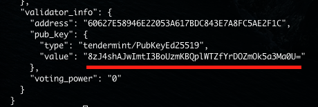

# Validator를 위한 빠른 실행 가이드
This document is available in [English](qs_val.md) also.

## 소개
이 가이드는 validator 노드를 준비하고 실행하기 위한 방법과 노드에 stake하는
방법을 기술한다. 이 가이드는 [amoabci
README](https://github.com/amolabs/amoabci/README.md)에 설명된 방법을 활용한
것이다.

## 화폐 자산
Validator에 stake하기 위한 충분한 AMO coin을 확보한다. 이 가이드는 어떻게 AMO
coin을 확보하는지는 설명하지 않는다.

## 사전준비

#### 서버 머신
물리적인 서버나 가상머신을 준비하고 안정적인 인터넷 연결과 빠른 저장장치를
확보한다. 최소 요구 사양은 다음과 같다:
* Intel i5나 그와 동급으로 2개의 core
* 8GB RAM
* 최소 500GB 여유 공간이 있는 SSD 저장장치

권장 사양은 다음과 같다:
* Intel i5나 그 이상으로 4개의 core
* 16GB RAM
* 최소 1TB 여유 공간이 있는 SSD 저장장치

이 가이드에서는 흔히 쓰이는 Ubuntu Linux가 서버에 설치돼 있다고 가정한다.

#### 필요한 패키지 설치
서버의 터미널에 접속하여 root 권한으로 필요한 패키지들을 설치한다:
```bash
sudo apt install git curl jq docker.io
```

#### 데이터 디렉토리 준비
여유 공간이 충분한 장치에 `data_root` 디렉토리를 준비한다. 이 디렉토리가
`/mynode`라고 가정하기로 한다. `config`와 `data` 디렉토리를 생성한다:
```bash
sudo mkdir -p /mynode/amo/config
sudo mkdir -p /mynode/amo/data
```

#### 설정 스크립트와 `genesis.json` 다운로드 
설정 스크립트를 다운로드한다:
```bash
cd $HOME
git clone https://github.com/amolabs/testnet
```
`genesis.json` 파일을 다운로드한다:
```bash
cd testnet
curl <rpc_addr>/genesis | jq '.result.genesis' > genesis.json
```

`rpc_addr`는 다음 테이블을 참조한다.

| `chain` | `rpc_addr` |
|-|-|
| mainnet | `20.194.0.193:26657` |
| testnet | `172.105.213.114:26657` |

예를 들어, **mainnet**을 위한 `genesis.json` 파일을 다운로드 하기 위해서는 다음
명령을 실행한다:
```bash
cd testnet
curl 172.104.88.12:26657/genesis | jq '.result.genesis' > genesis.json
```

## Docker를 이용하여 실행

#### `amolabs/amod` 이미지 가져오기
`amod` 이미지를 가져온다:
```bash
sudo docker pull amolabs/amod:1.8.3
```

#### 설정 스크립트 실행
현재 서버의 외부 ip 주소(`<ext_ip_addr>`)와 seed 노드의 `p2p_addr`를 파악한다.
`moniker`(실행할 노드의 이름)을 결정한다. 다음을 실행한다: 
```bash
sudo ./setup.sh -d 1.8.3 -e <ext_ip_addr> <data_root> <moniker> <p2p_addr>
```

| `chain` | `p2p_addr` |
|-|-|
| mainnet | `fbd1cb0741e30308bf7aae562f65e3fd54359573@172.104.88.12:26656` |
| testnet | `a944a1fa8259e19a9bac2c2b41d050f04ce50e51@172.105.213.114:26656` |

#### 최신 스냅샷 다운로드
Genesis 블록부터 동기화하는 대신 체인의 최신 스냅샷을 다운로드한 다음 그
지점부터 동기화를 한다. 모든 스냅샷의 목록은 다음과 같다:

| `SW version` | `DB backend` | `block_height` | size (uncompressed) | download |
|-|-|-|-|-|
| `v1.7.7` | `rocksdb` | `11762421` | 101GB (200GB) | [link](http://us-east-1.linodeobjects.com/amo-archive/cherryblossom_v1.7.7_rocksdb_11762421.tar.bz2)([sha256](http://us-east-1.linodeobjects.com/amo-archive/cherryblossom_v1.7.7_rocksdb_11762421.tar.bz2.sha256)) |
| `v1.7.5` | `rocksdb` | `7698783` | 70GB (141GB) | [link](http://us-east-1.linodeobjects.com/amo-archive/cherryblossom_v1.7.5_rocksdb_7698783.tar.bz2)([sha256](http://us-east-1.linodeobjects.com/amo-archive/cherryblossom_v1.7.5_rocksdb_7698783.tar.bz2.sha256)) |
| `v1.7.5` | `rocksdb` | `6451392` | 56GB (116GB) | [link](http://us-east-1.linodeobjects.com/amo-archive/cherryblossom_v1.7.5_rocksdb_6451392.tar.bz2)([sha256](http://us-east-1.linodeobjects.com/amo-archive/cherryblossom_v1.7.5_rocksdb_6451392.tar.bz2.sha256)) |
| `v1.6.5` | `rocksdb` | `2908399` | 21GB (50GB) | [link](http://us-east-1.linodeobjects.com/amo-archive/cherryblossom_v1.6.5_rocksdb_2908399.tar.bz2)([sha256](http://us-east-1.linodeobjects.com/amo-archive/cherryblossom_v1.6.5_rocksdb_2908399.tar.bz2.sha256)) |

스냅샷을 다운로드한다:
```bash
wget http://us-east-1.linodeobjects.com/amo-archive/cherryblossom_v1.7.7_rocksdb_11762421.tar.bz2
wget http://us-east-1.linodeobjects.com/amo-archive/cherryblossom_v1.7.7_rocksdb_11762421.tar.bz2.sha256
```
Checksum을 확인한다:
```basah
sha256sum cherryblossom_v1.7.7_rocksdb_11762421.tar.bz2
cat cherryblossom_v1.7.7_rocksdb_11762421.tar.bz2.sha256
```
두 결과가 같은 checksum을 출력하는지 확인한다. 체인 DB를 대체한다:
```bash
tar jxf cherryblossom_v1.7.7_rocksdb_11762421.tar.bz2
sudo rm -rf /mynode/amo/data/
sudo mv amo-data/amo/data/ /mynode/amo/
```

**NOTE:** 압축된 `*.tar.bz2` 파일로부터 압축 해제된 파일의 디렉토리 구조가
파일에 따라 다를 수 있다. 압축 해제된 `data/` 디렉토리가 `<data_root>/amo/`
디렉토리 아래에 잘 위치해 있는지 확인하여야 한다.

#### 컨테이너 실행
노드를 생성하고 실행한다:
```bash
./run.sh -d 1.8.3 -p -s /mynode
```

Docker 컨테이너의 상태를 확인한다:
```bash
docker ps
```
이름이 `amod`인 컨네이터가 있어야 한다. 노드의 상태를 확인한다:
```bash
curl localhost:26657/status
```
`catching_up`의 값이 true인지 확인한다. sync가 완료되기까지는 몇시간 또는
며칠이 걸릴 수도 있다. `catching_up`이 false가 될 때까지 기다린다.

#### 키 백업
`/mynode/amo/config` 아래에 위치한 `priv_validator_key.json`, `node_key.json`
파일을 안전한 곳에 보관한다. 풀노드를 운영하고자 하지만 실제 동작하는
validator는 아닌 경우 여기에서 작업은 완료된다.

## Stake 실행
### `amocli` 설치
코인을 stake하기 위해서는 `amocli`(AMO 클라이언트)를 설치해야 한다.
[설치](https://github.com/amolabs/amo-client-go#installation) 문서를 참조하여
`amocli`를 설치한다.

### 소유주 키 생성
위에서 실행한 노드의 소유주 계정을 위한 키를 생성한다 (이름이 `mynode`라 가정):
```bash
amocli key generate mynode
amocli key list
```
이름이 `mynode`인 계정의 주소를 확인한다.

### Validator 공개키 확인
```bash
curl localhost:26657/status
```
<p align="center"></p>

### Stake 거래 전송
`stake` tx를 전송한다:
```bash
amocli tx --user mynode stake <val_pubkey> <amount>
```
`val_pubkey`는 이전 단계에서 확인한 `pub_key`의 `value`이다. `amount`는
`1000000000000000000000000 mote` (1,000,000 AMO)의 정수배여야 한다.

스테이크를 조회한다:
```bash
amocli query stake <address>
```
`address`는 이름이 `mynode`인 계정의 주소이다.

