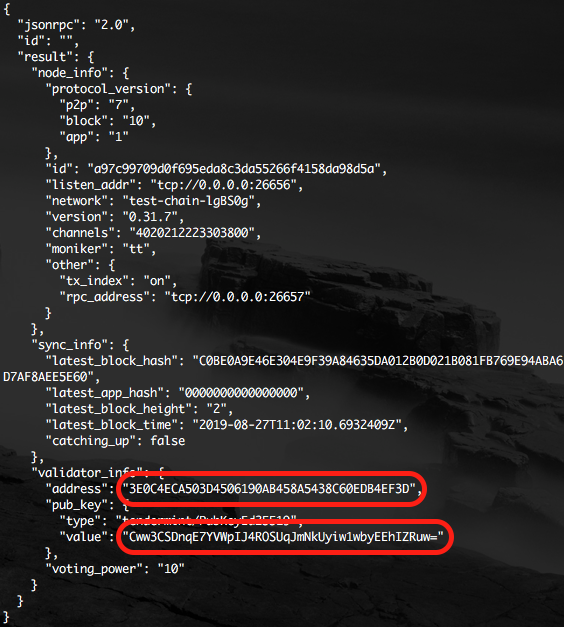

# Validator와 Delegator를 위한 빠른 실행 가이드
This document is available in [English](qs_val.md) also.

## 소개
이 가이드는 validator 노드를 준비하고 실행하기 위한 방법과 노드에 stake 하고
delegate 하는 방법을 기술한다. 이 가이드는 [amoabci
README](https://github.com/amolabs/amoabci/README.md)에 설명된 방법을 활용한
것이다.

## 화폐 자산
블록체인 노드가 합의 과정에 제대로 참여하기 위해서는 stake가 있어야 한다.
따라서, validator 노드를 운영하기 위해서는 사전에 AMO 코인을 충분히 확보하는
것이 필요하다. 테스트넷의 경우에는 다양한 경로로 AMO Labs에 요청하여 validator
노드를 위한 충분한 양의 AMO 코인을 얻을 수 있다. 그러나 메인넷의 경우 필요한
AMO 코인을 획득하는 것은 전적으로 사용자에게 달려 있다. 이 가이드는 메인넷을
위해 어떻게 코인을 확보할 수 있는지는 설명하지 않는다. 테스트넷과 메인넷 모두
`stake` 거래를 전송하기 전에 코인을 확보해 놓아야 한다.

## 노드 운영

### 사전준비

#### 서버 머신
Validator 노드를 실행하기 위해서는 인터넷 연결이 안정적인 물리적인 서버나
클라우드 서비스(Amazon AWS, Google cloud, Microsoft Azure 또는 유사한 서비스들)
상의 가상머신을 준비해야 한다. 이 가이드에서는 흔히 쓰이는 Ubuntu Linux가
서버에 설치돼 있다고 가정한다.

#### 필요한 패키지 설치
서버의 터미널에 접속하여 root 권한으로 `git`, `curl` 그리고 `jq`를 설치한다:
```bash
sudo apt install git curl jq
```

#### 데이터 디렉토리 준비
서버 머신 상에 AMO 관련 모든 데이터가 저장될 `data_root` 디렉토리가 필요하다.
해당 디렉토리를 만들기 위해, 다음 명령을 실행한다:
```bash
sudo mkdir -p <data_root>/amo/config
sudo mkdir -p <data_root>/amo/data
```

`data_root`가 `/mynode`라고 할 때 다음 명령을 실행한다:
```bash
sudo mkdir -p /mynode/amo/config
sudo mkdir -p /mynode/amo/data
```

#### 설정 스크립트 다운로드 
다음 명령을 실행하여 Validator 노드 설정을 도와주는 스크립트를 다운로드한다:
```bash
cd $HOME
git clone https://github.com/amolabs/testnet
```

#### `genesis.json` 다운로드
위 명령에 이어 다음 명령을 실행하여 `genesis.json` 파일을 다운로드한다:
```bash
cd testnet
curl <node_ip_addr>:<node_rpc_port>/genesis | jq '.result.genesis' > genesis.json
```

다음을 참조하여 접속하려는 네트워크에 알맞는 `node_ip_addr`과 `node_rpc_port`를
알아낸다.

| `chain` | `node_id` | `node_ip_addr` | `node_p2p_port` | `node_rpc_port` |
|-|-|-|-|-|
| mainnet | `fbd1cb0741e30308bf7aae562f65e3fd54359573` | `172.104.88.12` | `26656` | `26657` |
| testnet | `a944a1fa8259e19a9bac2c2b41d050f04ce50e51` | `172.105.213.114` | `26656` | `26657` |

예를 들어, **mainnet**을 위한 `genesis.json` 파일을 다운로드 하기 위해서는 다음
명령을 실행한다:
```bash
cd testnet
curl 172.104.88.12:26657/genesis | jq '.result.genesis' > genesis.json
```

### Docker를 이용하여 실행

#### `docker` 설치
Docker 공식 문서의 [Get Docker](https://docs.docker.com/get-docker/)을 참조하여
컴파일된 바이너리 혹은 소스파일을 이용하여 `docker`를 설치한다. Ubuntu Linux의 경우 다음 명령으로 docker를 설치한다:
```bash
sudo apt install docker.io
```

#### `amolabs/amod` 이미지 가져오기
amolabs의 공식 `amod` 이미지를 가져오기 위해서, 다음 명령을 실행한다:
```bash
sudo docker pull amolabs/amod:<tag>
```

`amod` 이미지의 특정 버젼을 가리키는 적절한 `tag`를 입력한다. 최신 이미지를
가져오기 위해서는 `tag`는 `latest`가 되거나 생략될 수 있다. 예를 들어, `1.6.6`
버젼의 이미지를 가져오기 위해서는 다음 명령을 실행한다:
```bash
sudo docker pull amolabs/amod:1.6.6
```

#### 설정 스크립트 실행
현재 서버의 외부 ip 주소(`<ext_ip_addr>`)와 seed 노드의
정보(`<node_id>@<node_ip_addr>:<node_p2p_port>`)를 파악한 후 다음 명령을
실행한다: 
```bash
sudo ./setup.sh -d -e <ext_ip_addr> <data_root> <moniker> <node_id>@<node_ip_addr>:<node_p2p_port>
```

`moniker`는 설정하려는 노드의 이름이다. 따라서 무엇이든 유일한 이름이 될 것으로
선택한다. 현재 서버의 외부 ip 주소가 `111.111.111.111`이고 데이터 디렉토리가
`/mynode`이고 노드 이름이 `mynodename`이고 당신이 mainnet에 접속하고 싶다면,
다음 명령을 실행한다: 
```bash
sudo ./setup.sh -d -e 111.111.111.111 /mynode mynodename fbd1cb0741e30308bf7aae562f65e3fd54359573@172.104.88.12:26656
```

#### 스냅샷으로 동기화 (선택사항)
노드를 실행하기 전에, 블록을 동기화하는 방법에는 두 가지 방법이 있다; genesis
블록부터 동기화 혹은 스냅샷부터 동기화. 만약 genesis 블록부터 동기화하기
원한다면 해당 단계를 건너뛸 수 있다.

Genesis 블록부터 동기화하는 것은 많은 물리적 시간을 소모하기에, 특정 블록
높이에서 찍은 블록 스냅샷을 제공한다. 제공되는 스냅샷은 다음과 같다:
| `chain_id` | `version` | `db_backend` | `block_height` |
|-|-|-|-|
| `cherryblossom_01` | `v1.7.5` | `rocksdb` | `6451392` |
| `cherryblossom_01` | `v1.6.5` | `rocksdb` | `2908399` |

**NOTE:** **mainne**t의 chain id 는 `cherryblossom_01` 이다.

스냅샷을 다운로드 하고 설정하기 위해서, 다음 명령을 실행한다:
```bash
sudo wget http://us-east-1.linodeobjects.com/amo-archive/<chain_id>_<version>_<db_backend>_<block_height>.tar.bz2
sudo tar -xjf <chain_id>_<version>_<db_backend>_<block_height>.tar.bz2
sudo rm -rf <data_root>/amo/data/
sudo mv data/ <data_root>/amo/
```

예를 들어, chain id 가 `cherryblossom_01`, version 은 `v1.7.5`, db backend 가
`rocksdb`, 블록 높이는 `6451392`, 데이터 디렉토리가 `/mynode` 이면, 다음 명령을
실행한다:
```bash
sudo wget http://us-east-1.linodeobjects.com/amo-archive/cherryblossom_v1.7.5_rocksdb_6451392.tar.bz2
sudo tar -xjf cherryblossom_v1.7.5_rocksdb_6451392.tar.bz2
sudo rm -rf /mynode/amo/data/
sudo mv data/ /mynode/amo/
```

스냅샷을로 동기화 하기 위한 설정이 끝났다.

#### 컨테이너 실행
노드를 생성하고 실행하기 위하여 다음 명령을 실행한다:
```bash
sudo docker run -d --name amod -v <data_root>:/amo amolabs/amod
```

노드를 시작하기 위하여 다음 명령을 실행한다:
```bash
sudo docker start amod
```

노드 상태를 확인하기 위하여 다음 명령을 실행한다:
```bash
sudo docker stats amod
```

나중에 노드를 중지할 필요가 있다면 다음 명령을 실행한다:
```bash
sudo docker stop amod
```

### 추가 작업

#### 키 백업
`/mynode/amo/config` 아래에 위치한 `priv_validator_key.json`, `node_key.json`
파일을 안전한 곳에 보관한다.

#### 정보 수집
다음 명령으로 노드의 validator 주소와 공개키를 확인하여 편리한 곳에 기록해
둔다.
```bash
curl localhost:26657/status
```

<p align="center"></p>

출력에서 `"sync_info"` 부분을 확하여 블록체인 네트워크의 다른 노드들과의 동기화
과정이 제대로 수행되고 있는지 확인한다. `"catching_up"`이 `true`일 경우
블록체인의 정보를 계속 수신하고 있는 중인 것이다. 그러니 동기화 과정이 끝날
때까지 기다린다. 동기화할 블록이 많을 경우에는 수시간, 또는 수일 정도 걸릴 수도
있다.

## 노드 업그레이드
AMO 블록체인 노드의 S/W는 때때로, 혹은 주기적으로 업그레이드된다. 새 버전의
노드 S/W가 릴리즈되면 가능한 빠른 시기에 업그레이드하는 것이 바람직하다. 특히
validator 노드를 운영하고 있고 업그레이드에 프로토콜 변경이 포함된 경우는
업그레이드 시점 전에 미리 준비하여 정확한 시간에 새 버전의 노드 S/W로
업그레이드해야 한다.

블록체인이 프로토콜이 변경되도록 지정된 블록높이에 도달하면 `amod` 서비스는
`protocol mismatch` 에러는 출력하며 동작을 멈춘다. 이 때 새로운 `amod` 도커
이미지를 확보하여 빠른 시간 안에 서비스를 재실행한다.

'On-chain Protocol Upgrade'가 어떻게 작동하는지에 대해 더욱 자세히 알기 위해서는
[Protocol](protocol.md#on-chain-protocol-upgrade) 문서를 참조한다.

### Docker를 이용하여

### 최신 이미지 가져오기
최신 `amolabs/amod` docker 이미지를 가져오기 위하여 다음 명령을 실행한다:
```bash
sudo docker pull amolabs/amod:latest
```

#### 컨테이너 재시작
`amod` docker 컨테이너를 재시작 하기 위하여 다음 명령을 실행한다:
```bash
sudo docker stop amod && sudo docker rm amod
sudo docker run -d --name amod -v <data_root>:/amo amolabs/amod:latest
```

## Stake 생성
**NOTE:** 테스트넷인 경우는 <a href="http://explorer.amolabs.io/wallet">AMO
블록체인 탐색기</a>에 접속하여 안내에 따른다.

### `amocli` 설치
코인을 stake 혹은 delegate 하기 위해서는 `amocli`(AMO 클라이언트)가 필요하다.
amo-client-go 문서에서
[설치](https://github.com/amolabs/amo-client-go#installation) 섹션을 참조하여
적절한 방법으로 `amocli`를 설치한다.

이 문서에서는 계정 키(amocli 키 사용자명 `myval`, 지갑 주소
`D2CC7F160874AF06027A09DC0E8DC67E85E6D704`)와 충분한 AMO 코인을 확보한 상태라고
가정한다. 이제 `stake` 거래를 블록체인에 전송해야 한다.  `stake` 거래를
위해서는 validator 공개키가 필요하다. 이 거래를 전송하는 행위는 이 공개키가
로드되어 실행되고 있는 validator 노드에 대해서 당신이 제어권을 행사하고 있다고
세상에 선언하는 의미가 있다.

### Validator 공개키 파악 
validator 공개키를 알아내기 위하여 서버의 터미널에 접속하여 다음 명령을
실행한다:
```bash
amod --home <data_root>/amo tendermint show_validator
# or
docker run -it --rm -v <data_root>/amo:/amo amolabs/amod amo tendermint show_validator
```
알맞은 `data_root`를 입력한다.

예를 들어, 데이터 디렉토리가 `/mynode`이면 다음 명령을 실행한다:
```bash
amod --home /mynode/amo tendermint show_validator
# or
docker run -it --rm -v /mynode/amo:/amo amolabs/amod amo tendermint show_validator
```

Validator 키가 다음과 같다고 가정한다:
```json
{
  "pub_key": {
    "type": "tendermint/PubKeyEd25519",
    "value": "+4jvv6ZCP+TxC0CwBQRr31ieZzj7KMZL3iwribL3czM="
  }
}
```
이제 validator 공개키가 준비되었다.

### Stake 거래 전송
일정량의 AMO 코인을 validator에게 stake 하기 위하여 다음 명령을 실행한다:
```bash
amocli tx --user <key_username> stake <validator_pub_key> <amount>
```
알맞은 `key_username`, `validator_pub_key` 그리고 `amount`를 입력한다.

예를 들어, 해당 공개키에 대해 1000000 AMO를 stake 하기 위하여 다음 명령을
실행한다:
```bash
amocli tx --user myval stake +4jvv6ZCP+TxC0CwBQRr31ieZzj7KMZL3iwribL3czM= 1000000000000000000000000 
```

### Stake 쿼리
일정량의 AMO 코인이 제대로 stake 되었는지 확인하기 위하여 다음 명령을 실행한다:
```bash
amocli query stake <key_address>
```
알맞은 `key_address`를 입력한다.

예를 들어, Validator 공개키에 대해 `myval`에게 1000000 AMO가 제대로 stake
되었는지 확인하기 위하여 다음 명령을 실행한다:
```bash
amocli query stake D2CC7F160874AF06027A09DC0E8DC67E85E6D704
```

### Validators 파악
모든 validator의 목록과 그들의 voting power등을 확인하기 위하여 다음 명령을
실행한다:
```bash
curl localhost:26657/validators
```

### Withdraw 거래 전송
Stake 된 AMO 코인 중 일부 혹은 전체를 출금하기 위하여 다음 명령을 실행한다:
```bash
amocli tx --user <key_username> withdraw <amount>
```
알맞은 `key_username`과 `amount`를 입력한다.

예를 들어, `myval`의 stake 중 100 AMO를 출금하기 위하여, 다음 명령을 실행한다:
```bash
amocli tx --user myval 100000000000000000000
```

## Delegate 생성
이 문서에서는 계정 키(amocli 키 사용자명 `mydel`, 지갑 주소
`4BFCD048B837135C1F23B6302000E096D48F99B8`)와 충분한 AMO 코인을 확보한 상태라고
가정한다. 이제 `delegate` 거래를 블록체인에 전송해야 한다. `delegate` 거래를
위해서는 당신이 일정량의 AMO 코인을 delegate 하고 싶은 validator의 계정
주소(account address)가 필요하다. 해당 가이드에서는 위임받는자(delegatee)의
계정 주소는 `D2CC7F160874AF06027A09DC0E8DC67E85E6D704`이라고 가정한다.

### Delegate 거래 전송
일정량의 AMO 코인을 validator에게 delegate 하기 위하여 다음 명령을 실행한다:
```bash
amocli tx --user <key_username> delegate <validator_account_address> <amount>
```
알맞은 `key_username`, `validator_account_address` 그리고 `amount`를 입력한다.

예를 들어, validator `myval`의 계정 주소에 100 AMO를 delegate 하기 위하여 다음
명령을 실행한다:
```bash
amocli tx --user mydel delegate D2CC7F160874AF06027A09DC0E8DC67E85E6D704 100000000000000000000 
```

### Delegate 쿼리
일정량의 AMO 코인이 제대로 delegate 되었는지 확인하기 위하여 다음 명령을
실행한다:
```bash
amocli query delegate <key_address>
```
알맞은 `key_address`를 입력한다.

예를 들어, 100 AMO가 제대로 delegate 되었는지 확인하기 위하여 다음 명령을
실행한다:
```bash
amocli query delegate 4BFCD048B837135C1F23B6302000E096D48F99B8
```

### Retract 거래 전송
Delegate 된 AMO 코인 중 일부 혹은 전체를 출금하기 위하여 다음 명령을 실행한다:
```bash
amocli tx --user <key_username> retract <amount>
```
알맞은 `key_username`과 `amount`를 입력한다.

예를 들어, `mydel`의 delegate stake 중 1 AMO를 출금하기 위하여, 다음 명령을
실행한다:
```bash
amocli tx --user mydel 1000000000000000000
```
